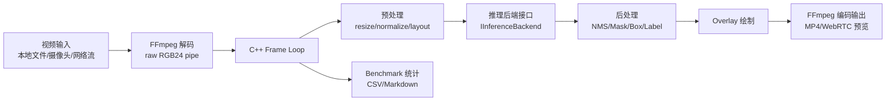
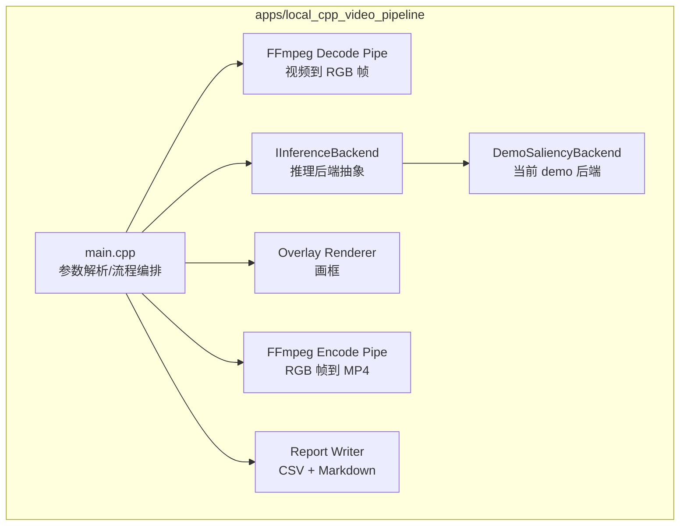

# 低延迟视频 AI 推理系统设计文档

## 1. 项目目标

构建一个可演示、可扩展、可 benchmark 的低延迟视频 AI 推理系统，用于展示视频解码、帧处理、AI 推理、后处理、编码输出、延迟统计和多后端对比能力。

当前机器没有 NVIDIA GPU，因此本地优先实现 C++ 视频处理主流程，并以 CPU/Intel 友好的推理后端作为第一阶段目标。Triton/TensorRT/CUDA/NPPI 作为未来 NVIDIA 机器或远端服务器的可迁移目标保留在架构中。

## 2. 当前阶段范围

当前已完成第一版 C++ MVP 骨架：

- FFmpeg 子进程解码输入视频为 RGB24 raw frame。
- C++ 主循环读取帧、执行推理后端接口、绘制检测框、统计耗时。
- FFmpeg 子进程将处理后的 RGB24 raw frame 编码为 MP4。
- 输出 CSV 逐帧延迟明细和 Markdown 延迟报告。
- 当前推理后端为 `demo-saliency`，用于验证管线，不是真实神经网络。

## 3. 总体架构



## 4. 模块划分



## 5. 当前 C++ MVP 数据流

```text
input.mp4
  -> ffmpeg -i input.mp4 -vf scale=WIDTH:HEIGHT -pix_fmt rgb24 -f rawvideo pipe:1
  -> C++ fread(raw RGB frame)
  -> DemoSaliencyBackend::infer()
  -> C++ draw_rect()
  -> C++ fwrite(raw RGB frame)
  -> ffmpeg -f rawvideo -pix_fmt rgb24 -s WIDTHxHEIGHT -i pipe:0 -c:v libx264 output.mp4
  -> latency.csv + report.md
```

## 6. 关键接口设计

当前推理后端接口：

```cpp
class IInferenceBackend {
public:
    virtual ~IInferenceBackend() = default;
    virtual const char* name() const = 0;
    virtual std::vector<Detection> infer(
        const std::vector<unsigned char>& rgb,
        int width,
        int height) = 0;
};
```

后续 ONNX Runtime、OpenVINO、ncnn、MNN 后端都应实现该接口，尽量避免修改解码、编码、报告等主流程代码。

## 7. 后端演进计划

### 7.1 当前后端：demo-saliency

用途：

- 验证 C++ 主循环、FFmpeg 管道、计时、绘制和报告。
- 不声明为 AI 模型结果。

### 7.2 下一步：ONNX Runtime C++ CPU

计划：

- 增加 `OnnxRuntimeBackend`。
- 准备轻量检测模型的 ONNX 文件。
- 实现 resize、normalize、NCHW/NHWC 转换。
- 实现检测框解码和 NMS。
- 与 `demo-saliency` 使用同一套报告结构。

### 7.3 Intel 加速：OpenVINO

计划：

- 增加 `OpenVINOBackend`。
- 对比 CPU、Intel GPU 或 NPU 可用设备。
- 重点观察推理延迟、吞吐、初始化时间和部署复杂度。

### 7.4 端侧对比：ncnn / MNN

计划：

- 增加 ncnn 后端。
- 增加 MNN 后端。
- 保持相同输入视频、分辨率、模型族和报告格式。
- 记录模型转换、接口复杂度、性能和内存占用。

### 7.5 NVIDIA 远端/未来路径：Triton/TensorRT/CUDA/NPPI

计划：

- 保留 `triton_model_repo/`。
- 增加 Triton client。
- 在远端 NVIDIA 机器或未来本机具备 NVIDIA GPU 后接入 TensorRT。
- 将 resize、padding、color convert、normalize 等前后处理迁移到 CUDA/NPPI 路径做对比。

## 8. 目录结构

```text
workspace_video_ai_dev/
  apps/
    local_cpp_video_pipeline/
      src/main.cpp
      scripts/build.ps1
      scripts/run_demo.ps1
      CMakeLists.txt
      README.md
  docs/
    ENVIRONMENT.md
    ROADMAP.md
    开发协作规范.md
    低延迟视频AI推理系统_设计文档.docx
  reports/
    local_cpp_video_pipeline/
  data/
    samples/
  models/
  triton_model_repo/
  third_party/
  benchmarks/
```

## 9. 当前运行方式

构建：

```powershell
.\apps\local_cpp_video_pipeline\scripts\build.ps1
```

运行测试：

```powershell
.\apps\local_cpp_video_pipeline\scripts\run_demo.ps1 `
  -InputPath C:\work\workspace_own\workspace_video_ai_dev\data\samples\testsrc2_720p_6s.mp4 `
  -Width 640 `
  -Height 360 `
  -Fps 25 `
  -MaxFrames 120
```

输出：

- 标注视频：`reports/local_cpp_video_pipeline/*.annotated.mp4`
- 延迟报告：`reports/local_cpp_video_pipeline/*.report.md`
- 逐帧 CSV：`reports/local_cpp_video_pipeline/*.latency.csv`

## 10. 当前环境结论

- 本机无 NVIDIA GPU。
- 本机 CPU 为 Intel Core Ultra 7 155H。
- 本机 GPU 为 Intel Arc Graphics。
- FFmpeg 已可用，并支持 QSV、D3D11VA、D3D12VA、OpenCL、Vulkan 等能力。
- 已安装 WinLibs，具备 g++、cmake、ninja 等基础 C++ 工具。
- 当前优先路线是 C++ 主流程 + ONNX Runtime/OpenVINO/ncnn/MNN 后端。

## 11. 下一步计划

1. 接入 ONNX Runtime C++ CPU 后端。
2. 准备一个轻量检测模型 ONNX 文件。
3. 增加真实模型预处理、推理、后处理和 NMS。
4. 复用当前 CSV/Markdown 报告。
5. 更新本设计文档中的后端接口和性能数据。

